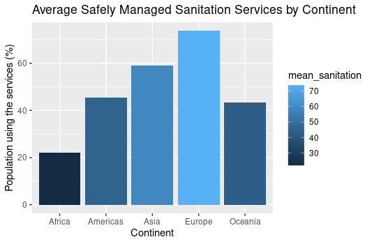

```{r setup, include=FALSE}
knitr::opts_chunk$set(echo = TRUE)
```

## **Analyzing the Effects of Global Sanitation On Population and Health Trends** {style="color: blue"}

**Sanitation and health are two crucial factors that affect the well-being of the population worldwide.** In this report, we will examine four visualizations that demonstrate different aspects of global sanitation and health trends. The data used for this analysis comes from the United Nations International Children's Emergency Fund (UNICEF) and includes information from various countries worldwide.

\_\_\_\_\_\_\_\_\_\_\_\_\_\_\_\_\_\_\_\_\_\_\_\_\_\_\_\_\_\_\_\_\_\_\_\_\_\_\_\_\_\_\_\_\_\_\_\_\_\_\_\_\_\_\_\_\_\_\_\_\_\_\_\_\_\_\_\_\_\_\_\_\_\_\_\_\_

#### [*1. Average Safely Managed Sanitation Services by Continent Against the Proportion of Population using them*]{.underline} {style="color: orange"}

{width="533" height="250"}

The above bar chart shows the average proportion of the population using safely managed sanitation services by continent. The graph illustrates that Europe has the highest proportion of people using these services, followed by the Americas, Oceania, Asia, and finally Africa.

------------------------------------------------------------------------

#### [*2. Effect of safely managed sanitation services on Life Expectancy*]{.underline} {style="color: orange"}

{width="533" height="250"}

The second visualization is scatterplot with a line regression for the world on average. The graph shows that there is a positive correlation between the proportion of the population using safely managed sanitation services and life expectancy at birth. This correlation suggests that sanitation services are an important factor in improving health outcomes.

------------------------------------------------------------------------

#### [*3. Time Series of Life Expectancy at Birth by Continent*]{.underline} {style="color: orange"}

{width="533" height="250"}

The above time series is of life expectancy at birth by continent. The chart illustrates that, over time, life expectancy has increased for all continents. However, the rate of improvement varies between the continents, with Europe consistently having the highest life expectancy. Relating it to the first visualization, Europe has the highest population using sanitation services and Europe is also the consistently highest in life expectancy. This serves as enough proof that sanitation and health are interlinked.

------------------------------------------------------------------------

#### [*4. World Map of Population*]{.underline} {style="color: orange"}

{width="533" height="250"}

The fourth visualization is a world map that shows the latest population density of different countries. The map highlights the countries with lower than average population, which are very few in comparison to the total number of countries, indicating that population has stably increased in most of the world owing to the increase of sanitation and life expectancy.

\_\_\_\_\_\_\_\_\_\_\_\_\_\_\_\_\_\_\_\_\_\_\_\_\_\_\_\_\_\_\_\_\_\_\_\_\_\_\_\_\_\_\_\_\_\_\_\_\_\_\_\_\_\_\_\_\_\_\_\_\_\_\_\_\_\_\_\_\_\_\_\_\_\_\_\_\_

### Conclusion {style="color: blue"}

In conclusion, the visualizations presented in this report demonstrate the significant relationship between sanitation, health, and population trends. These visualizations highlight the **importance of providing as well as having access to safely managed sanitation services to the population, which can lead to better health outcomes and ultimately, a better quality of life.**

\_\_\_\_\_\_\_\_\_\_\_\_\_\_\_\_\_\_\_\_\_\_\_\_\_\_\_\_\_\_\_\_\_\_\_\_\_\_\_\_\_\_\_\_\_\_\_\_\_\_\_\_\_\_\_\_\_\_\_\_\_\_\_\_\_\_\_\_\_\_\_\_\_\_\_\_\_
